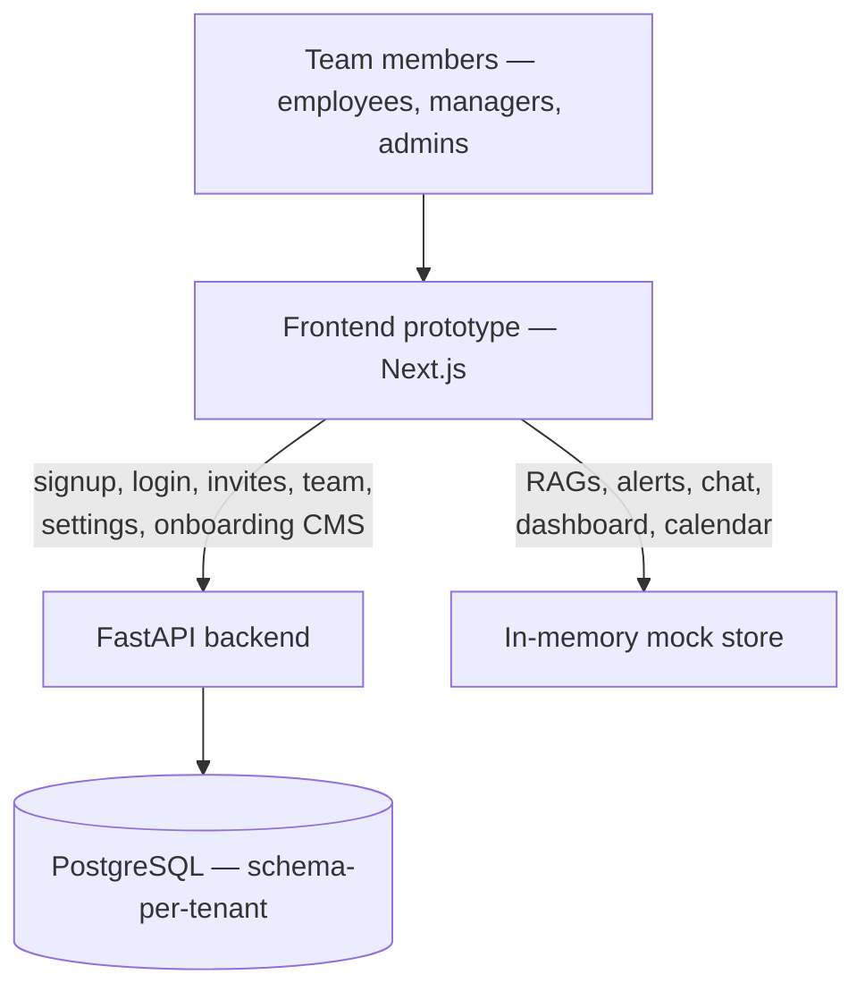
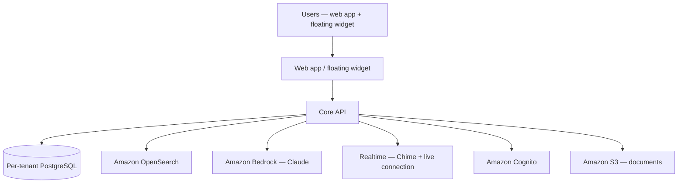

# SafeIQ — Case Study & Architecture Overview (draft for sales team)

**Status: draft, needs client-facing confirmation before it leaves the building — see "Before this goes to a prospect" at the bottom.**

This follows the same format as the other project write-ups sales is collecting: case-study snapshot, architecture overview (with a diagram), capabilities, typical flows, integrations, and roles.

## Case study snapshot

| | |
|---|---|
| **Client** | Neil [confirm exact company/trading name before this is used externally — see note below] |
| **Industry** | Care & Social Services — employee safeguarding and compliance *(inferred from the product's "Safeguarding Lead" role, care-plan-linked alerts, and the demo organisation "Bright Care Homes Ltd" used throughout the prototype; please confirm this is the correct sector framing before it's quoted to a prospect)* |
| **Project / Use case** | An AI-powered employee safety & compliance platform. Organisations build topic-specific knowledge bases ("RAGs") from their own policy documents; employees ask questions and get answers grounded only in that approved content; a keyword/AI alert layer flags risk signals in conversations (e.g. safeguarding concerns) and routes them to a manager for review, with a scheduled "Touch Point" meeting-request workflow, an audit trail, and an organisation-wide dashboard. |
| **Technologies (current build)** | Next.js, React, TypeScript, Tailwind CSS, FastAPI, PostgreSQL (schema-per-tenant), SQLAlchemy, Alembic, Argon2id, JWT |
| **Technologies (proposed production stack, not yet built)** | AWS (single region, London), Amazon Bedrock (Anthropic Claude), Amazon OpenSearch, Amazon Chime, Amazon Cognito, Amazon S3 |
| **Logo** | Not available yet — needs to be requested from the client directly; nothing was fabricated here. |

## Status note — read before using this externally

This project is at different levels of maturity depending on the module, and the sales material should be honest about that rather than presenting it as one finished system:

- **Prototype (fully working, demo-data only):** every screen — RAG creation, alerts, dashboards, chat/calls, calendar, touch points — is fully clickable end to end against realistic mock data. This is what's safe to demo live.
- **Real backend (built and working):** sign-up/login, magic-link invites, team & role management, team member profiles (notes, custom alert rules), account settings, real login history, and the onboarding video CMS all run against a real multi-tenant Postgres backend today.
- **Proposed, not yet built:** the AI-answering pipeline itself (RAG grounding via Bedrock/Claude), OpenSearch-backed search, real-time chat/voice/video via Chime, and Cognito-based auth are all in a signed-off-pending **discovery pack** (`docs/architecture/`) — proposed designs the client hasn't signed off on yet, not shipped infrastructure. Don't present these as live.

## Architecture overview

### What's built today

The frontend is one Next.js app. A real account (email/password sign-up or an accepted invite) exercises the FastAPI backend for identity, team management, and onboarding content; every organisation gets its own physically separate Postgres schema, created at sign-up. Everything the backend doesn't implement yet (RAGs, alerts, chat, the dashboard, the calendar) renders from an in-memory mock store instead — this is what lets the whole product be demoed and iterated on with the client before the AI/real-time infrastructure is built.

### Proposed production architecture (discovery pack — pending client sign-off)

Everything runs on AWS in a single UK region. Documents are read, classified, and indexed by an AI pipeline (a human confirms the AI's filing suggestion — never silent auto-filing); questions are answered by Claude via Bedrock, grounded only in that organisation's approved content and always citing sources; OpenSearch combines keyword and meaning-based search; chat/voice/video/screen-share share one real-time system built on Chime rather than four bolted-together features. Every organisation's data sits in its own physically separate database compartment and search index — a structural guarantee, not a configurable setting.

## Main capabilities

| Area | What it does |
|---|---|
| Accounts & team | Org/employee sign-up, magic-link invites, roles (employee, manager, support, administrator), 2FA/IP-lock, team member profiles with notes and custom alert rules |
| RAG knowledge bases | Create topic-specific knowledge bases from uploaded policy documents; employees ask questions and get answers grounded only in that RAG's approved content, with source citations |
| Alerts & safeguarding | Keyword and AI-driven detection of risk signals in conversations, routed to a designated manager; staged case handling (open → reviewed → closed), severity levels, escalation notes |
| Touch Points | An employee flags one or more alerts and requests a meeting with a designated manager; the manager accepts (confirming a date/time, creating a calendar booking), declines with a reason, or proposes a new time |
| Communications | Direct, RAG-related, and alert-related conversations, clearly tagged by type; content visibility gated to Safeguarding Leads where relevant |
| Dashboard & reporting | Organisation-wide view of RAG activity, live alerts, touch points, team activity, and knowledge-base health |
| Calendar | Bookings (including accepted Touch Points), day/week views |
| Audit trail | Append-only, hash-chained log of every sensitive action (signup, verification, login, role change, invite lifecycle) — GDPR-erasable content, tamper-evident proof that it happened |
| Onboarding | Video CMS with ordering, audience filtering, search, view/share tracking, and analytics |

## Typical flows

**Create and use a RAG**
An admin creates a RAG, uploads source documents, and assigns it to team members with an access code. An employee opens the RAG and asks a question; the system answers only from that RAG's approved content and names its source. Independently of the AI, every question is also scanned against configured alert keywords — a safety-critical alert never depends on the AI "deciding" correctly.

**An alert gets raised and resolved**
A question or conversation trips a keyword/severity rule and opens an `AlertCase` against the employee, owned by their designated manager. The manager reviews it through a staged pipeline, can escalate it to a full incident, and closes it once resolved — all logged to the audit trail.

**Touch Point request**
An employee ticks one or more of their own flagged alerts and sends a meeting request to a designated manager. The manager accepts with a date/time (which creates a real calendar booking), declines with a reason, or proposes an alternative time.

## Integrations

| Service (proposed) | Used for |
|---|---|
| Amazon Bedrock (Claude) | Answering questions from a RAG's approved content; classifying uploaded documents; the "help me find material" research assistant |
| Amazon OpenSearch | Combined keyword + meaning-based search over each organisation's own indexed content |
| Amazon Chime | Voice calls, video calls, screen-share |
| Amazon Cognito | Identity/session management *(recommended, not yet signed off — see ADR list in `docs/architecture/`)* |
| Amazon S3 | Document storage |
| Real backend today | PostgreSQL (schema-per-tenant), Argon2id password hashing, JWT sessions, a pluggable email-sender interface (dev builds just log instead of sending), a pluggable KYC-provider interface (dev build auto-approves) |

## Roles at a glance

- **Employee** — asks questions of assigned RAGs, sees their own alerts and touch points
- **Manager / Support** — owns alerts for their team, responds to touch-point requests, can be a Safeguarding Lead with elevated content-visibility
- **Administrator** — full organisation management: team, roles, RAGs, alert rules, settings
- **Super Admin** — organisation owner
- **SafeIQ Internal** — cross-organisation support account (modelled, not yet fully scoped)

---

## Before this goes to a prospect

A few things need a human decision before this is safe to hand to sales as-is:

1. **Confirm the real client/company name and whether it can be named at all.** "Neil" is the point of contact we've been working with; the demo data uses a fictional organisation ("Bright Care Homes Ltd") to represent the target sector — that is *not* necessarily the real client's actual company name, and this engagement may be confidential until launch.
2. **Confirm the industry framing.** The "care & social services / safeguarding" read is inferred from the product's own vocabulary (Safeguarding Lead, care-plan alerts) — it hasn't been independently confirmed as the client's actual sector.
3. **Get an actual logo from the client**, with permission to use it — none exists in this repo, and nothing here should be treated as a substitute.
4. **Be clear in the deck about what's prototype vs. proposed vs. real**, per the status note above — overselling the AI/real-time layer as already live would misrepresent the engagement's actual stage (Milestone 1 discovery, not yet signed off).
